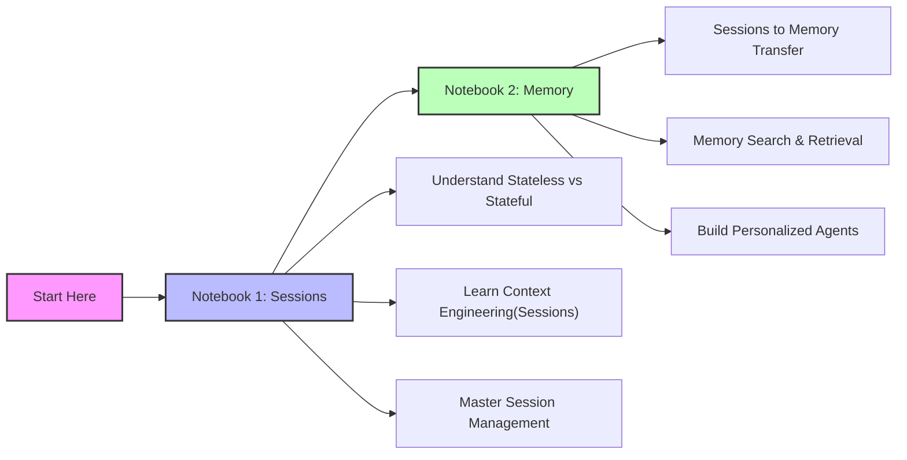
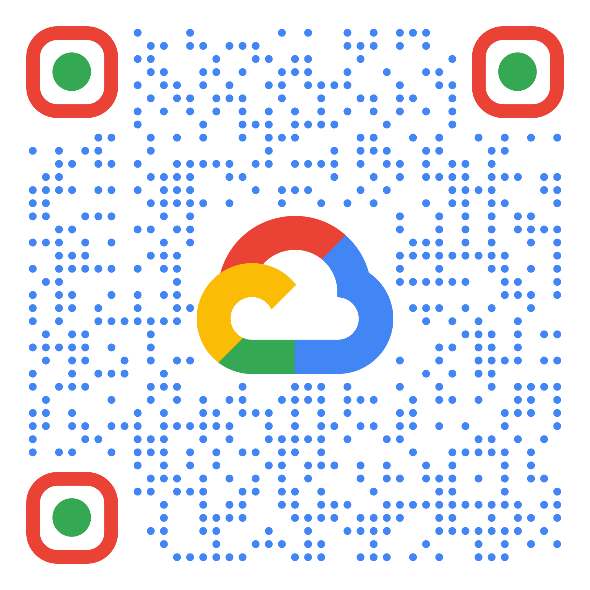

# Google ADK - Session And Memory (SAM)

This repository focuses exclusively on the **Session and Memory** aspects of Google ADK (Agent Development Kit), providing comprehensive educational notebooks that demonstrate how to build stateful, memory-enabled AI agents.

## Repository Focus

This educational series specifically covers:
- **Sessions**: Managing conversation history and context within interactions
- **Memory**: Implementing persistent, searchable knowledge that spans across conversations
- **Context Engineering**: Building truly intelligent agents that remember and learn

> **Note**: This repository intentionally focuses on Sessions and Memory as these are foundational concepts for building personalized AI agents. For other Google ADK features like multi-agent systems, tools, or deployment, please refer to the official Google ADK documentation.

## Educational Notebooks

### 📘 Notebook 1: Building Intelligent Agents with Sessions
Learn how to transform stateless LLMs into intelligent, stateful agents that can maintain conversation context and working memory. Explore Sessions, Events, Session State, and the concept of Context Engineering.

### 📘 Notebook 2: Building Intelligent Agents with Long-Term Memory
Give your agents long-term memory - a persistent, searchable knowledge store that transcends individual conversations. Learn how to transfer session data to memory and implement both reactive and proactive retrieval patterns.

## Getting Started

### Prerequisites

- Python 3.8 or higher
- Google Cloud Project (for Vertex AI) or Gemini API Key (for Google AI Studio)
- Basic understanding of Python and async programming

### Installation

1. Clone this repository:
```bash
git clone https://github.com/msampathkumar/google-adk-sam.git
cd google-adk-sam
```

2. Create a virtual environment:
```bash
python -m venv venv
source venv/bin/activate  # On Windows: venv\Scripts\activate
```

3. Install dependencies:
```bash
pip install -r requirements.txt
```

### Running the Notebooks

1. Start Jupyter:
```bash
jupyter notebook
```

2. Navigate to the notebook you want to run:
   - `Notebook.ipynb` - Sessions and Context Engineering
   - `Notebook2.ipynb` - Memory and Long-term Knowledge

3. Configure your authentication:
   - **For Vertex AI**: Set your PROJECT_ID in the notebook
   - **For Google AI Studio**: Set your GEMINI_API_KEY in the notebook

## Quick Links

- 📓 [Notebook 1: Sessions](Notebook.ipynb) | [](https://colab.research.google.com/github/msampathkumar/google-adk-sam/blob/main/Notebook.ipynb)
- 📓 [Notebook 2: Memory](Notebook2.ipynb) | [](https://colab.research.google.com/github/msampathkumar/google-adk-sam/blob/main/Notebook2.ipynb)

## Learning Path



## Repository QR Code



## Additional Resources

- [Google ADK Documentation](https://google.github.io/adk-docs/)
- [Google ADK Sessions Guide](https://google.github.io/adk-docs/sessions/session/)
- [Google ADK Memory Guide](https://google.github.io/adk-docs/sessions/memory/)

---

# Uwaga / Caution

> **Note**: Google ADK is continuously evolving. This educational content is based on google-adk==1.16. Please check for updates and version compatibility.

> **Author**: Community contribution for Google ADK education. Google, Google Gemini & Google-ADK are improving & evolving everyday.
